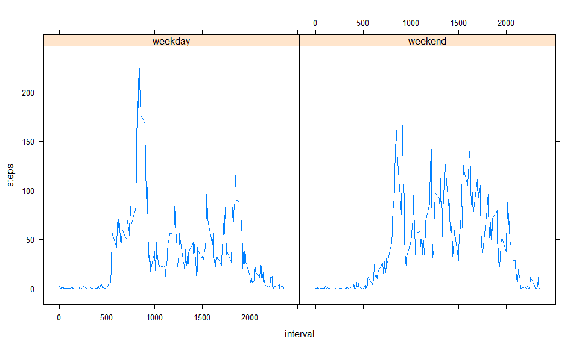

# Reproducible Research: Peer Assessment 1


---
title: "Repr. research assignment 1"
author: "Aurel Prosz"
date: '2017 október 28 '
output: html_document
---
## System Information


```r
Sys.info()
```

```
##           sysname           release           version          nodename 
##         "Windows"          "10 x64"     "build 15063" "DESKTOP-I8UL3IQ" 
##           machine             login              user    effective_user 
##          "x86-64"          "Paurel"          "Paurel"          "Paurel"
```
## analyze_data.R
### Loading and preprocessing the data
Import the dependencies  

```r
Sys.setlocale("LC_TIME", "English")
```

```
## [1] "English_United States.1252"
```

```r
library(lattice)
library(dplyr)
library(ggplot2)
```
First we read in the raw data from the specific file "activity.csv".  
**Don't forget to set your working directory where this file presents!**  

```r
datax <- read.csv("activity.csv", sep = ",", 
     na.strings = "NA")
```
Let's look at the first 5 rows of this data:

```r
head(datax, 5)
```

```
##   steps       date interval
## 1    NA 2012-10-01        0
## 2    NA 2012-10-01        5
## 3    NA 2012-10-01       10
## 4    NA 2012-10-01       15
## 5    NA 2012-10-01       20
```
We should format the *date* column to Date format:

```r
class(datax$date)
```

```
## [1] "factor"
```

```r
datax$date <- as.Date(datax$date)
class(datax$date)
```

```
## [1] "Date"
```
### What is mean total number of steps taken per day?

Aggregate the data frame by *date* column:

```r
datax.sums <-  aggregate(x = datax["steps"],
     FUN = sum,
     by = list(Group.date = datax$date), 
     na.rm=TRUE)

head(datax.sums, 5)
```

```
##   Group.date steps
## 1 2012-10-01     0
## 2 2012-10-02   126
## 3 2012-10-03 11352
## 4 2012-10-04 12116
## 5 2012-10-05 13294
```
Make a histogram from the results:


```r
hist(datax.sums$steps, col = "red", 
     xlab = "Total number of steps", 
     breaks = 20, 
     main = "Histogram of total number of steps per day")
```

<!-- -->

Calculate the median and the mean for the total number of steps per day:

```r
numberofsteps.median <- median(datax.sums$steps)
numberofsteps.mean <- mean(datax.sums$steps)
```
The **median** is 10395 and the **mean** is 9354.2295082

### What is the average daily activity pattern?

Make a time series plot of the 5-minute interval and the average number of steps taken, averaged across all days! First we have to use the aggregate function to calculate the mean of the steps taken averaged across the days.

```r
datax.mean <-  aggregate(x = datax["steps"],
     FUN = mean,
     by = list(datax$interval), 
     na.rm=TRUE)
```
The next step is to plot the results:

```r
plot( datax.mean$Group.1, datax.mean$steps, type = 'l', xlab = "Interval", ylab = "Averaged number of steps", main = "The 5-minute interval and the average number of steps taken, averaged across all days")
```

<!-- -->
Which 5-minute interval, on average across all the days in the dataset, contains the maximum number of steps?

```r
datax.mean.max <- max(datax.mean$steps, na.rm = TRUE)
maxrow <- which(datax.mean$steps == datax.mean.max)
```
The 5 minute interval which contains the maximum is: 104

### Imputing missing values
Calculate and report the total number of missing values in the dataset!


```r
navalues <- nrow(datax) - sum(complete.cases(datax))
```
The number of *NA* values: 2304  

### Strategy for imputing NA data
I choosed to calculate the mean of the specific 5 minute interval for the missing data. The following code automaticaly change the NA data with the mean for the corresponding 5 minute interval.

```r
datax.new <- datax
for (i in c(1:length(datax$steps))){
  datax$steps[1]
  if(is.na(datax$steps[i]))
    {
    index <- datax$interval[i]
    datax.new$steps[i] <- datax.mean$steps[which(datax.mean$Group.1 == index)]
  
  }
  
}
```

### Create a new dataset that is equal to the original dataset but with the missing data filled in
Here you can see the missing values have been imputed in a new dataset.


```r
head(datax.new, 5)
```

```
##       steps       date interval
## 1 1.7169811 2012-10-01        0
## 2 0.3396226 2012-10-01        5
## 3 0.1320755 2012-10-01       10
## 4 0.1509434 2012-10-01       15
## 5 0.0754717 2012-10-01       20
```
 ### Make a histogram of the total number of steps taken each day and Calculate and report the mean and median total number of steps taken per day. Do these values differ from the estimates from the first part of the assignment? What is the impact of imputing missing data on the estimates of the total daily number of steps?
 

```r
datax.new.sums <-  aggregate(x = datax.new["steps"],
                         FUN = sum,
                         by = list(Group.date = datax.new$date), 
                         na.rm=TRUE)
```
Creating the histogram

```r
hist(datax.new.sums$steps, col = "red", 
     xlab = "Total number of steps", 
     breaks = 20, 
     main = "Histogram of total number of steps per day based on the imputed dataset")
```

<!-- -->
Calculating the median and the mean

```r
numberofsteps.new.median <- median(datax.new.sums$steps)
numberofsteps.new.mean <- mean(datax.new.sums$steps)
```
The **median** is 1.0766189\times 10^{4} and the **mean** is 1.0766189\times 10^{4}.   
**All of the values have been increased and the median and the mean is the same for the new dataset.**  

### Are there differences in activity patterns between weekdays and weekends?
Let's create a new column containing the information for the weekday or weekend atribute of the given day!

```r
#Create the new column
datax.new.mutated <- mutate(datax.new, days = weekdays(datax.new$date))
```

```
## Warning: package 'bindrcpp' was built under R version 3.4.2
```

```r
datax.new.mutated_2 <- mutate(datax.new.mutated, days_class = ifelse(as.character(datax.new.mutated$days) %in% c("Sunday", "Saturday"), "Weekend", "Weekday"))
#Create two separate variables for weekend and weekdays
weekdays <- datax.new.mutated_2[datax.new.mutated_2$days_class == "Weekday", ]
weekends <- datax.new.mutated_2[datax.new.mutated_2$days_class == "Weekend", ]
#Calculate the statistics for both of the variables
weekdays.mean <-  aggregate(x = weekdays["steps"],
                             FUN = mean,
                             by = list(interval = weekdays$interval), 
                             na.rm=TRUE)
weekdays.mean <- mutate(weekdays.mean, day = "weekday")

weekends.mean <-  aggregate(x = weekends["steps"],
                            FUN = mean,
                            by = list(interval = weekends$interval), 
                            na.rm=TRUE)
weekends.mean <- mutate(weekends.mean, day = "weekend")
# bind the two dataset together
binded <- rbind(weekdays.mean, weekends.mean)
```
We constructed the dataset, the next step is to plot it.

```r
xyplot(steps ~ interval | day, data = binded, type = "l")
```

<!-- -->
The answer is yes, there is a clearly difference between weekend and weekday activity. On weekdays people tend to be more active in the morning than in weekends when they can sleep more.

